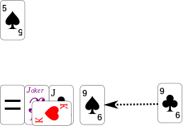

# shimurasan

「しむらさん」(Shimua-san: means Ms. Formula) はトランプを使ったカードゲームです。

一次方程式をカードを使って解いて遊びます。

- 人数 2名
- プレイ時間 10分
- 対象年齢 中学生以上

# ルール

## 用意するもの
最初に、紙、ペン、イコールカード、xカードを用意します。

ゲーム解説シートを印刷し、イコールカードとxカードを切り離しましょう。

x カードはジョーカーで代用できます。
また、イコールカードは適当な紙に等号を書いて代わりにしてもOKです。

## ゲームの準備

じゃんけんで、親を決めます。

親は、以下のようにカードを置きます。

図で、♠の5の位置に置くカードは♠であれば何でも構いません。

カードのマークは以下に対応します。

- ♠ ＋
- ♥ ×
- ♦ ÷
- ♣ ー

そして、カードの数字は整数を表します。

以下のような例となります。

- ♠5 → ＋5
- ♥A → ×1
- ♦10 → ÷10
- ♣K → −13

図は、+5 = x という数式を表しています。

次に、カードをよく切り2つに分けてプレーヤーにカードを配ります。

配られたカードは伏せていても、表にしていても構いません。

親→子→親→子 の順番で、カードを1つずつ置いていきます。

カードは以下のように置きます。

1枚目、親が♣Jを置いた場合

これは、+5 = x -11 を表します。

2枚目、子が♥Kを置いた場合

これは、+5 = ( x -11 )×13 を表します。

3枚目、親が♠9を置いた場合

これは、+5 = ( x -11 )×13 ＋9を表します。

4枚目、子が♦Aを置いた場合

これは、、+5 =( ( x -11 )×13 ＋9 / 1 )を表します。

この後自分が得点しやすいように考えてカードを置いていきましょう。
4枚置いたら、できた数式を紙に書いておきましょう。

これで、準備が終わりです。

## ゲーム開始

親からはじめます。

交互にターンを進めます。
1つのターンは3つの操作になります。

1. 式を整理する
2. 式のどれかのカードを中和してカードを取る
3. 中和に使ったカードを式の反対辺に配置する

1. 式を整理する

例えば、、+5 =( ( x -11 )×13 ＋9 / 1 ) のような式は+5 = ( x -11 )×13 ＋9 の式に直して ♦A を外すことができます。
他にも、+5 = ( x -11 )×13 ＋9 −9  のような式は、♠9と♣9を外すことができます。外したカードは自分の得点カードになります。

式を整理するところがなければそのままでも構いません。

2. 式にカードを追加してどれかのカードを中和する

例えば、+5 = ( x -11 )×13 ＋9 の式に♣9を追加して、＋9を中和することを考えます。

まず、♣9を追加します。

♠9と♣9は中和できます。

3. 中和したカードを取り、中和に使ったカードを式の反対辺に配置する

中和した♠9は自分の得点カードになります。♣9は上辺に移行して上辺を5÷9とします。

中和に使うカードは得点カードを使ってもいいですが、得点が減ってしまいます。

中和に使うカードは複数枚使ってもいいですが、中和する場所は一箇所だけしかできません。

ちょうどいい中和カードが無かった場合は、中和せずにカードを追加するだけでもOKです。

これは÷1を追加することで、式には変更がありません。

しかし、このようなテクニックは次の人のターンでカードを丸取りされるので、注意が必要です。

上辺を入れ替えることもできます。

これは上辺が＋5−9となっているので、♣4で2枚のカードを入れ替えることができます。この場合、♠5と♣9は両方自分の得点カードになります

複数枚同士で入れ替えることもできます。

これは (x-11+5)×13 を ♠2と♣8を使って  (x+2-8)×13 にする作戦です。

# ゲーム終了

式を変形していき、下辺がxだけになったらゲーム終了です。

紙に数式を書き写しましょう。

この例では

(( 5 ー 9 ) ÷13 ) + 11 = x

となります。これを解くと

x = 10 + ( 9 / 13 )   

が答えになります。

最初の式

+5 =( ( x -11 )×13 ＋9 / 1 )

にあてはめて、間違いがなければ採点します。
得点カードの枚数が多いほうが勝ちです。

#  拡張ルール

特典カードの数字を足した数で勝敗を決めてもいいですね。